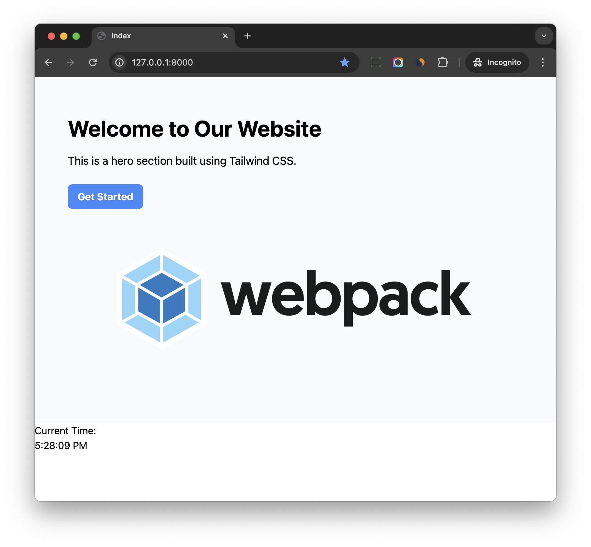

# Setup React

## Install Dependency

Now go to directory which contains `package.json`, by default, it is root directory.

```bash
$ npm install @babel/preset-react eslint-plugin-react --save-dev
```

Once done, edit `.babelrc` to make babel to use the above `@babel/preset-react`

```json hl_lines="11"
{
   ...
  "presets": [
    [
      "@babel/preset-env",
      {
        "useBuiltIns": "usage",
        "corejs": "3.0.0"
      }
    ],
    "@babel/preset-react"
  ],
  ...
}
```

Edit `.eslintrc` to add `plugin:react/recommended` to the `extends`, so `eslint` can recognize React syntax.

```js hl_lines="5"
{
  ...
  "extends": [
    "eslint:recommended",
    "plugin:react/recommended"
  ],
  ...
}
```

Next, let's install React

```bash
$ npm install react react-dom
```

That is it, now the frontend project can work with React.

## Sample App

Create `frontend/src/application/app_react.js`

```js
import React, { useState, useEffect } from 'react';
import { createRoot } from 'react-dom/client';


const Clock = () => {
  const [time, setTime] = useState(new Date());

  useEffect(() => {
    const timer = setInterval(() => {
      setTime(new Date());
    }, 1000);

    // Clear the interval when the component unmounts
    return () => clearInterval(timer);
  }, []);

  return (
    <div>
      <h1>Current Time:</h1>
      <p>{time.toLocaleTimeString()}</p>
    </div>
  );
};

const root = document.getElementById('root');
const rootElement = createRoot(root);
rootElement.render(<Clock />);
```

```
$ npm run start
```

Edit Django template `templates/index.html`

```html hl_lines="25-26"


<!DOCTYPE html>
<html>
<head>
  <meta charset="utf-8" />
  <title>Index</title>
  <script src="https://cdn.tailwindcss.com"></script>
  
  
</head>
<body>

<div class="bg-gray-50 py-5" data-jumbotron>
  <div class="container mx-auto px-4 py-10">
    <h1 class="text-4xl font-bold leading-tight">Welcome to Our Website</h1>
    <p class="mt-4 text-lg">This is a hero section built using Tailwind CSS.</p>
    <button class="bg-blue-500 hover:bg-blue-700 text-white font-bold py-2 px-4 mt-6 rounded-lg">Get Started</button>
    <div class="flex justify-center">
      
    </div>
  </div>
</div>

<div id="root">
</div>

</body>
</html>
```

1. We added a `root` div to let React render the component.
1. We use `` to load two entrypoint files to the template.

```bash
$ python manage.py runserver
```

!!! note
    Here we use React to render specific component in the page, and we can still use raw HTML to write other parts, which is convenient

Here is the screenshot:


