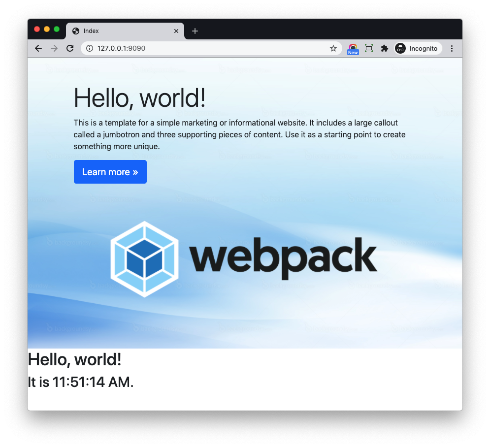

# Setup React

## Install Dependency

Go to `frontend` directory

```bash
$ npm install @babel/preset-react --save-dev
```

Once done, edit `frontend/.babelrc` to make babel to use the React preset

```json hl_lines="4"
{
  "presets": [
    "@babel/preset-env",
    "@babel/preset-react"
  ],
  "plugins": [
    "@babel/plugin-syntax-dynamic-import",
    "@babel/plugin-proposal-class-properties"
  ]
}
```

```bash
$ npm install react react-dom
```

That is it, now the frontend project can work with React.

## Sample App

Update `frontend/src/application/app2.js`

```js
import React from 'react';
import ReactDOM from 'react-dom';

class Clock extends React.Component {
  constructor(props) {
    super(props);
    this.state = {date: new Date()};
  }

  componentDidMount() {
    this.timerID = setInterval(
      () => this.tick(),
      1000
    );
  }

  componentWillUnmount() {
    clearInterval(this.timerID);
  }

  tick() {
    this.setState({
      date: new Date()
    });
  }

  render() {
    return (
      <div>
        <h1>Hello, world!</h1>
        <h2>It is {this.state.date.toLocaleTimeString()}.</h2>
      </div>
    );
  }
}

ReactDOM.render(
  <Clock />,
  document.getElementById('root')
);
```

This is a simple Clock React component come from [React doc](https://reactjs.org/docs/state-and-lifecycle.html)

!!! note
    You can also put the React components code to the `src/components` and import the component in entryfiles. (`app2.js` in this case)

```
$ npm run start
```

Edit Django template `templates/index.html`

```html hl_lines="26-27 29"


<!DOCTYPE html>
<html>
<head>
  <meta charset="utf-8" />
  <title>Index</title>
  
</head>
<body>

<div class="jumbotron py-5">
  <div class="container">
    <h1 class="display-3">Hello, world!</h1>
    <p>This is a template for a simple marketing or informational website. It includes a large callout called a
      jumbotron and three supporting pieces of content. Use it as a starting point to create something more unique.</p>
    <p><a class="btn btn-primary btn-lg" href="#" role="button">Learn more »</a></p>

    <div class="d-flex justify-content-center">
      
    </div>

  </div>
</div>

<div id="root">
</div>



</body>
</html>
```

1. We added a `root` div to let React render the component.
1. We use `` to load two entrypoint files to the template.

```bash
$ python manage.py runserver
```

!!! note
    Here we use React to render specific component in the page, and we can still use raw HTML to write other parts, which is convenient

Here is the screenshot:


