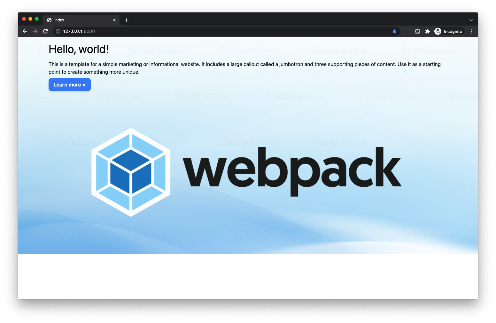

# Tailwind CSS

This guide will help you install and config `Tailwind v3`

## Install Dependency

In directory which contains the `package.json`, install `tailwindcss` and `postcss-import`

```bash
$ npm install -D tailwindcss@latest postcss-import
```

Once done, update `postcss.config.js`

```
// https://tailwindcss.com/docs/using-with-preprocessors

module.exports = {
  plugins: [
    require('postcss-import'),
    require('tailwindcss/nesting')(require('postcss-nesting')),
    require('tailwindcss'),
    require('postcss-preset-env')({
      features: { 'nesting-rules': false }
    }),
  ]
};
```

Next, generate a config file for your project using the Tailwind CLI utility included when you install the `tailwindcss` npm package

```bash
$ npx tailwindcss init
```

Now `tailwind.config.js` is generated

```js
module.exports = {
  content: [],
  theme: {
    extend: {},
  },
  plugins: [],
}
```

!!! note

    Please make sure `tailwind.config.js` exists in the same directory as `postcss.config.js`

## JIT

From Tailwind V3, it enabled `JIT` (Just-in-Time) all the time.

> Tailwind CSS works by scanning all of your HTML, JavaScript components, and any other template files for class names, then generating all of the corresponding CSS for those styles.

> In order for Tailwind to generate all of the CSS you need, it needs to know about every single file in your project that contains any Tailwind class names.

So we should config `content` section of the `tailwind.config.js`, then Tailwind will know which css classes are used.

Let's update *frontend/tailwind.config.js*

```js
const Path = require("path");
const pwd = process.env.PWD;

// We can add current project paths here
const projectPaths = [
  Path.join(pwd, "../example/templates/**/*.html"),
  // add js file paths if you need
];

const contentPaths = [...projectPaths];
console.log(`tailwindcss will scan ${contentPaths}`);

module.exports = {
  content: contentPaths,
  theme: {
    extend: {},
  },
  plugins: [],
}
```

Notes:

1. Here we add Django templates path to the `projectPaths`
1. And then we pass the `contentPaths` to the `content`
1. The final built css file will contain css classes used in the Django templates

## Import Tailwind CSS

Update *src/styles/index.scss*

```scss
@import "tailwindcss/base";
@import "tailwindcss/components";
@import "tailwindcss/utilities";

.jumbotron {
  // should be relative path of the entry scss file
  background-image: url("../../vendors/images/sample.jpg");
  background-size: cover;
}

.btn-blue {
  @apply inline-block px-4 py-2;
  @apply font-semibold rounded-lg shadow-md;
  @apply bg-blue-500 text-white;
  @apply hover:bg-blue-700 focus:outline-none;
  @apply focus:ring-2 focus:ring-blue-400 focus:ring-opacity-75;
}
```

```
$ npm run start

tailwindcss will scan django_basic/example/templates/**/*.html
```

Edit Django template `templates/index.html`

```html hl_lines="8 28"


<!DOCTYPE html>
<html>
<head>
  <meta charset="utf-8" />
  <title>Index</title>
  
</head>
<body>

<div class="jumbotron">
  <div class="w-full max-w-7xl p-4 mx-auto">
    <h1 class="text-4xl mb-4">Hello, world!</h1>

    <p class="mb-2">This is a template for a simple marketing or informational website. It includes a large callout called a
      jumbotron and three supporting pieces of content. Use it as a starting point to create something more unique.</p>

    <p class="mb-2"><a class="btn-blue" href="#" role="button">Learn more »</a></p>

    <div class="flex justify-center">
      
    </div>

  </div>
</div>



</body>
</html>
```

```bash
$ python manage.py runserver
```



## Live Reload

When you add Tailwind css class in Django template, it would be cool if the page can `auto live realod`, please check link below

[Live Reload Support](live_reload.md)

## Tutorials

To learn more about Tailwind and Django, you can check

1. [Django Tailwind CSS Alpine.js Tutorial](https://www.accordbox.com/blog/django-tailwind-css-alpinejs-tutorial/)
2. [wagtail-tailwind-blog](https://github.com/AccordBox/wagtail-tailwind-blog)
