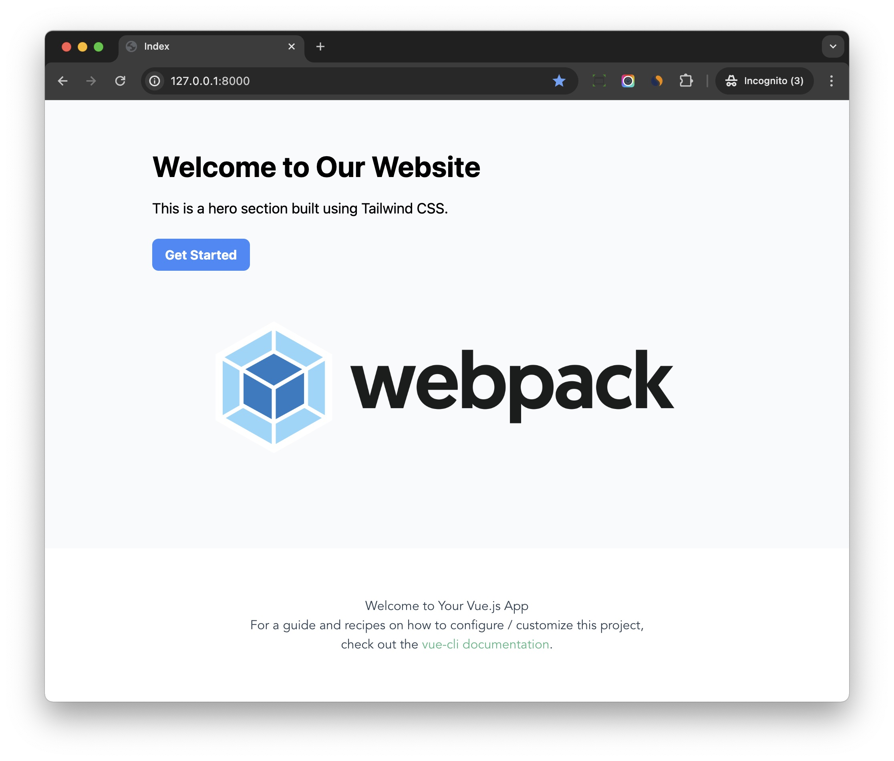

# Setup Vue

## Install

!!! note
    We will setup Vue 3 in this tutorial

Now go to directory which contains `package.json`, by default, it is root directory.

```bash
$ npm install vue-loader @vue/compiler-sfc --save-dev
# install vue
$ npm install vue@3
```

Edit `frontend/webpack/webpack.common.js`

```js
const { VueLoaderPlugin } = require('vue-loader');

plugins: [
    ...

    new VueLoaderPlugin()
],

module: {
  rules: [
    ...
      
    {
      test: /\.vue$/,
      loader: "vue-loader",
    },
  ],
},
```

1. Add `VueLoaderPlugin` to `plugins`
1. Please also add rule to the `module.rules` to let webpack use `vue-loader` to process `.vue` files.

That is it, now the frontend project should work with Vue.

## Sample App

Create `frontend/src/components/HelloWorld.vue`

```vue
<template>
  <div class="hello">
    <h1>{{ msg }}</h1>
    <p>
      For a guide and recipes on how to configure / customize this project,<br>
      check out the
      <a href="https://cli.vuejs.org" target="_blank" rel="noopener">vue-cli documentation</a>.
    </p>
  </div>
</template>

<script>
  export default {
    name: 'HelloWorld',
    props: {
      msg: String
    }
  }
</script>

<!-- Add "scoped" attribute to limit CSS to this component only -->
<style scoped>
  h3 {
    margin: 40px 0 0;
  }
  ul {
    list-style-type: none;
    padding: 0;
  }
  li {
    display: inline-block;
    margin: 0 10px;
  }
  a {
    color: #42b983;
  }
</style>
```

Create `frontend/src/components/App.vue`

```vue
<template>
  <div id="app">
    <HelloWorld msg="Welcome to Your Vue.js App"/>
  </div>
</template>

<script>
import HelloWorld from './HelloWorld.vue'

export default {
  name: 'App',
  components: {
    HelloWorld
  }
}
</script>

<style>
#app {
  font-family: Avenir, Helvetica, Arial, sans-serif;
  -webkit-font-smoothing: antialiased;
  -moz-osx-font-smoothing: grayscale;
  text-align: center;
  color: #2c3e50;
  margin-top: 60px;
}
</style>
```

In the `App.vue`, we import `HelloWorld.vue` and render it under `<div id="app">`

Create `frontend/src/application/app_vue.js`

```js
import { createApp } from 'vue';
import App from '../components/App.vue';

createApp(App).mount('#app');
```

Now the file structures would seem like this:

```
$ npm run start
```

Edit Django template `templates/index.html`

```html hl_lines="9 10"


<!DOCTYPE html>
<html>
<head>
  <meta charset="utf-8" />
  <title>Index</title>
  <script src="https://cdn.tailwindcss.com"></script>
  
  
</head>
<body>

<div class="bg-gray-50 py-5" data-jumbotron>
  <div class="container mx-auto px-4 py-10">
    <h1 class="text-4xl font-bold leading-tight">Welcome to Our Website</h1>
    <p class="mt-4 text-lg">This is a hero section built using Tailwind CSS.</p>
    <button class="bg-blue-500 hover:bg-blue-700 text-white font-bold py-2 px-4 mt-6 rounded-lg">Get Started</button>
    <div class="flex justify-center">
      
    </div>
  </div>
</div>

<div id="app">
</div>

</body>
</html>
```

```bash
$ python manage.py runserver
```

!!! note
    Here we use Vue to render specific component in the page, and we can still use raw HTML to write other parts, which is convenient


